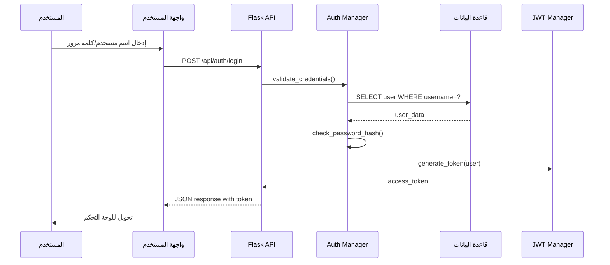
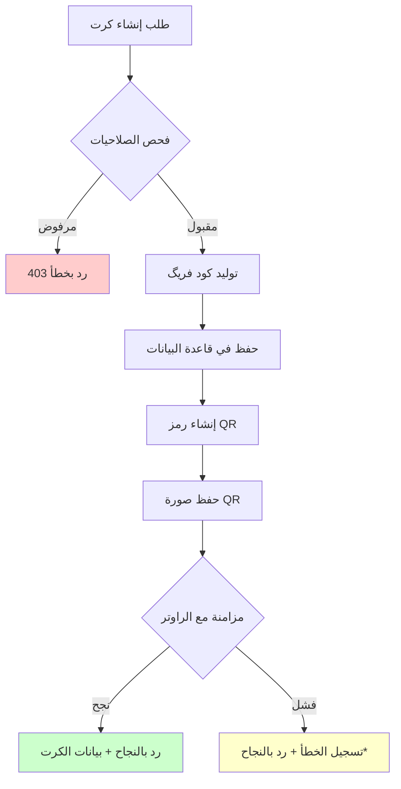
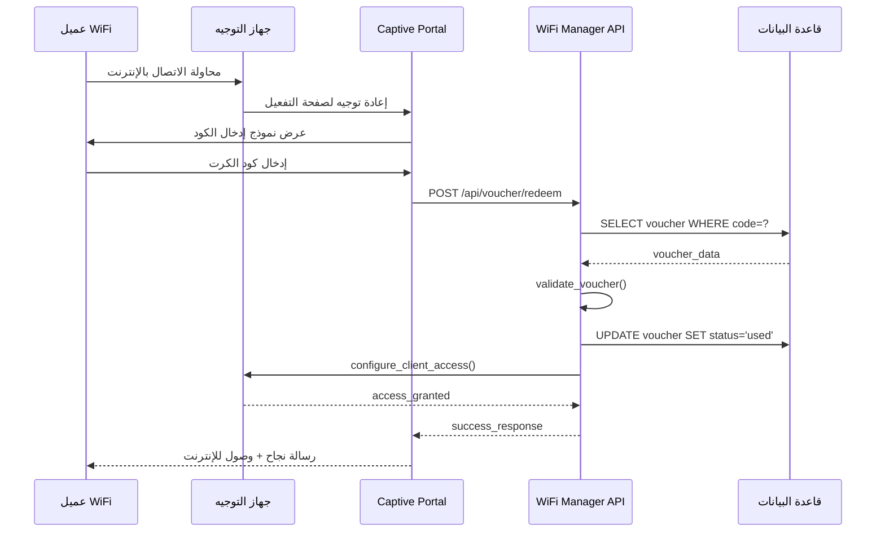
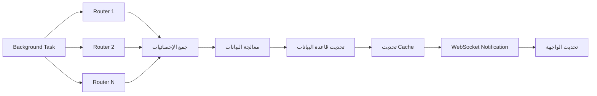
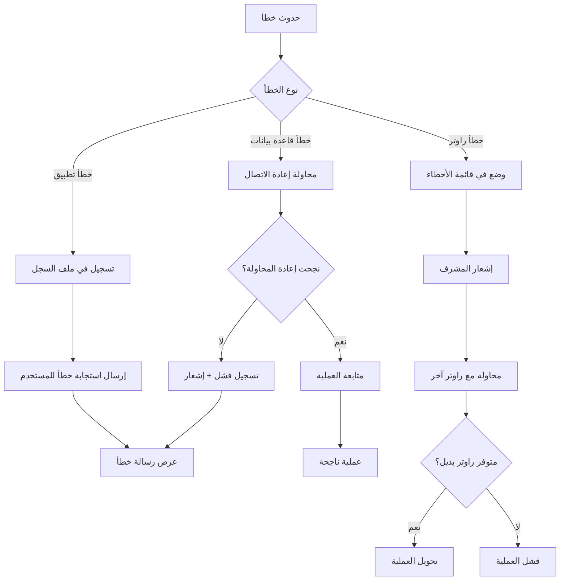
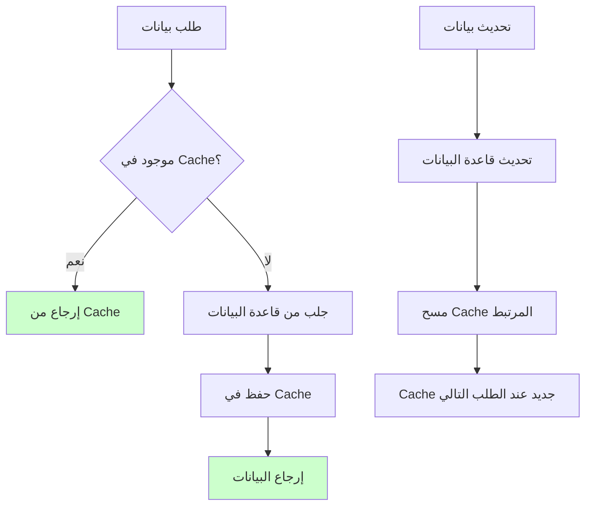
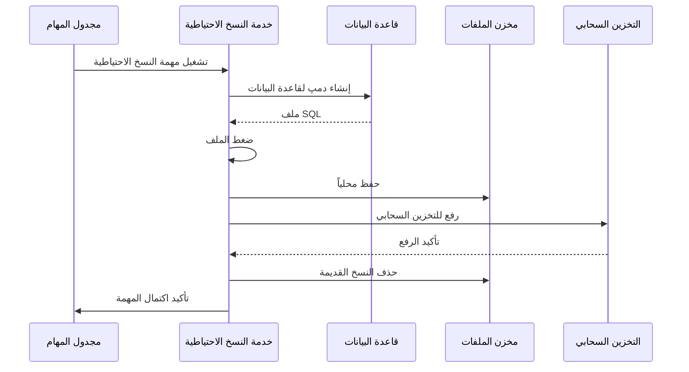

# 🔄 تدفق البيانات

## نظرة عامة

هذا المستند يوضح كيف تتدفق البيانات عبر النظام من نقطة الدخول حتى النتيجة النهائية.

## التدفقات الأساسية

### 1. تدفق تسجيل الدخول
```
المستخدم → واجهة تسجيل الدخول → Flask Route → Auth Manager → Database → JWT Creation → Response
```

#### خطوات مفصلة:


### 2. تدفق إنشاء كرت جديد
```
طلب إنشاء → التحقق من الصلاحيات → إنشاء الكرت → إنشاء QR → مزامنة الراوتر → رد JSON
```

#### مخطط التدفق:


### 3. تدفق تفعيل كرت (Captive Portal)
```
عميل يتصل بـ WiFi → يُحوّل لصفحة التفعيل → إدخال الكود → التحقق → إنشاء جلسة → وصول للإنترنت
```

#### التسلسل الزمني:


### 4. تدفق مراقبة الشبكة
```
مهمة مراقبة → جمع بيانات من الراوترات → تحديث قاعدة البيانات → تحديث Cache → إشعار الواجهة
```

#### عملية المراقبة:


## تدفقات البيانات المتقدمة

### 5. تدفق إنشاء كروت متعددة
```python
# نمط Batch Processing
def create_bulk_vouchers(quantity, config):
    vouchers = []
    for i in range(quantity):
        voucher = create_single_voucher(config, batch_id)
        vouchers.append(voucher)
        
        # إنشاء QR كل 10 كروت
        if i % 10 == 0:
            generate_qr_batch(vouchers[-10:])
    
    # مزامنة مع الراوترات
    sync_vouchers_to_routers(vouchers)
    
    return vouchers
```

### 6. تدفق معالجة الأخطاء


## تدفق البيانات في الوقت الفعلي

### 7. Real-time Updates
```javascript
// Frontend WebSocket handling
const ws = new WebSocket('ws://localhost:5000/ws');

ws.onmessage = function(event) {
    const data = JSON.parse(event.data);
    
    switch(data.type) {
        case 'new_voucher':
            updateVouchersList(data.voucher);
            break;
        case 'session_update':
            updateActiveSessionsTable(data.session);
            break;
        case 'router_status':
            updateRouterStatus(data.router_id, data.status);
            break;
    }
};
```

```python
# Backend WebSocket broadcasting
from flask_socketio import SocketIO, emit

socketio = SocketIO(app)

def broadcast_voucher_created(voucher):
    socketio.emit('new_voucher', {
        'type': 'new_voucher',
        'voucher': voucher.to_dict()
    }, room='admins')

def broadcast_session_update(session):
    socketio.emit('session_update', {
        'type': 'session_update', 
        'session': session.to_dict()
    }, room='operators')
```

### 8. تدفق التخزين المؤقت


## تدفق إدارة الجلسات

### 9. دورة حياة الجلسة
```python
class SessionLifecycle:
    def create_session(voucher_code, client_ip):
        # 1. التحقق من صحة الكرت
        voucher = validate_voucher(voucher_code)
        
        # 2. إنشاء جلسة جديدة
        session = Session(
            voucher=voucher,
            client_ip=client_ip,
            start_time=datetime.utcnow(),
            end_time=voucher.calculate_end_time()
        )
        
        # 3. تكوين الراوتر
        configure_router_access(session)
        
        # 4. بدء المراقبة
        start_session_monitoring(session)
        
        return session
    
    def monitor_session(session):
        while session.is_active():
            # جمع إحصائيات الاستخدام
            usage = collect_usage_stats(session)
            
            # فحص الحدود
            if usage.data_exceeded() or usage.time_exceeded():
                terminate_session(session)
                break
            
            # تحديث البيانات
            update_session_stats(session, usage)
            
            sleep(30)  # مراقبة كل 30 ثانية
```

### 10. تدفق النسخ الاحتياطية


## تدفق معالجة الأخطاء المتقدمة

### 11. Error Recovery Patterns
```python
class ErrorRecoveryManager:
    def handle_database_error(self, error):
        if "connection lost" in str(error):
            # إعادة تأسيس الاتصال
            self.reconnect_database()
            return "retry"
        elif "deadlock" in str(error):
            # إعادة المحاولة بعد فترة
            time.sleep(random.uniform(0.1, 0.5))
            return "retry"
        else:
            # تسجيل وإبلاغ
            self.log_error(error)
            self.notify_admin(error)
            return "fail"
    
    def handle_router_error(self, router, error):
        # محاولة راوتر بديل
        backup_router = self.find_backup_router(router)
        if backup_router:
            return self.failover_to_backup(backup_router)
        
        # وضع الراوتر في قائمة الصيانة
        self.mark_router_down(router)
        return "partial_failure"
```

### 12. تدفق تحليل الأداء
```python
class PerformanceAnalyzer:
    def analyze_request_flow(self, request_id):
        timeline = []
        
        # جمع نقاط القياس
        timeline.append(("request_start", self.get_timestamp()))
        timeline.append(("auth_check", self.get_timestamp()))
        timeline.append(("database_query", self.get_timestamp()))
        timeline.append(("business_logic", self.get_timestamp()))
        timeline.append(("response_sent", self.get_timestamp()))
        
        # تحليل الاختناقات
        bottlenecks = self.identify_bottlenecks(timeline)
        
        # إنشاء توصيات التحسين
        recommendations = self.generate_recommendations(bottlenecks)
        
        return {
            'timeline': timeline,
            'bottlenecks': bottlenecks,
            'recommendations': recommendations
        }
```

## تحسين تدفق البيانات

### نصائح للأداء
1. **استخدم Connection Pooling** لقاعدة البيانات
2. **فعّل Caching** للبيانات المتكررة
3. **استخدم Async Operations** للعمليات البطيئة
4. **راقب Memory Usage** وقم بالتنظيف الدوري
5. **استخدم Batch Processing** للعمليات المتعددة

### مراقبة التدفق
```python
# تتبع تدفق البيانات
import logging
from functools import wraps

def trace_data_flow(func):
    @wraps(func)
    def wrapper(*args, **kwargs):
        request_id = generate_request_id()
        
        logging.info(f"[{request_id}] Starting {func.__name__}")
        start_time = time.time()
        
        try:
            result = func(*args, **kwargs)
            duration = time.time() - start_time
            
            logging.info(f"[{request_id}] Completed {func.__name__} in {duration:.3f}s")
            return result
            
        except Exception as e:
            duration = time.time() - start_time
            logging.error(f"[{request_id}] Failed {func.__name__} after {duration:.3f}s: {e}")
            raise
    
    return wrapper
```

---

**🔄 خلاصة**: فهم تدفق البيانات ضروري لتحسين الأداء وحل المشاكل بفعالية!